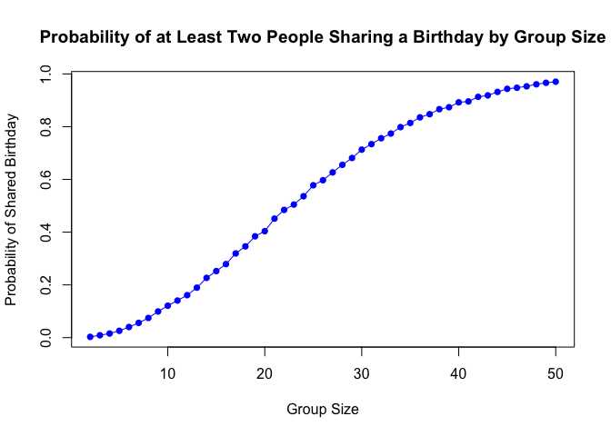
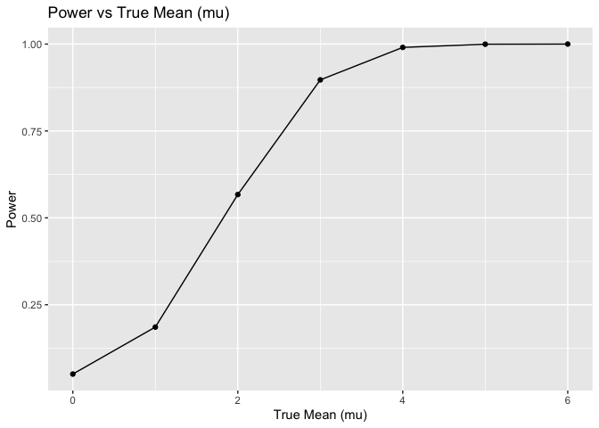
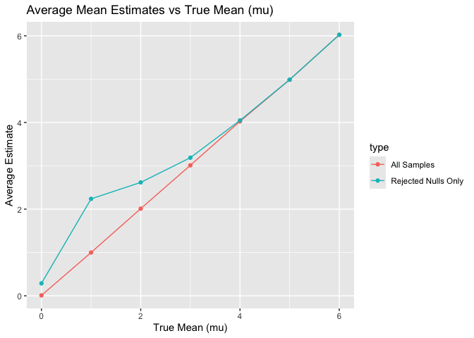
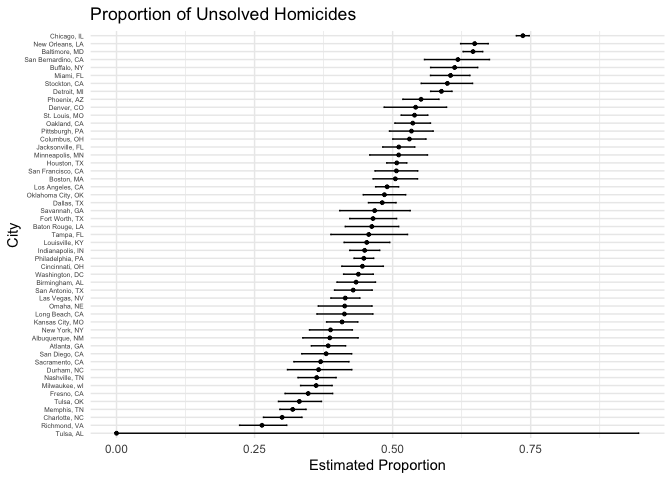

p8105_hw5_ww2744
================
Wenjie Wu

# Problem 1

``` r
duplicate_birthday = function(n) {

  birthdays = sample(1:365, n, replace = TRUE)  
  return(length(birthdays) != length(unique(birthdays)))
  
}
```

``` r
max_group_size = 50  
num_simulations = 10000  

probabilities = numeric(max_group_size - 1)
group_sizes = 2:max_group_size

for (n in group_sizes) {
  duplicates = 0  
  
  for (i in 1:num_simulations) {
    
    birthdays = sample(1:365, n, replace = TRUE)
    
    if (length(birthdays) != length(unique(birthdays))) {
      duplicates = duplicates + 1
    }
  }
  
  probabilities[n - 1] = duplicates / num_simulations
}
```

``` r
plot(group_sizes, probabilities, type = "o",
     xlab = "Group Size", ylab = "Probability of Shared Birthday",
     main = "Probability of at Least Two People Sharing a Birthday by Group Size",
     col = "blue", pch = 16)
```

<!-- -->

- As the group size increases, the probability of shared birthdays rises
  quickly. By a group size of around 50, the probability of shared
  birthdays approaches almost 100%.

# Problem 2

``` r
n = 30
sigma = 5
mu_values = c(0, 1, 2, 3, 4, 5, 6)
alpha = 0.05
n_sim = 5000

simulate_power = function(mu) {
  results = replicate(n_sim, {
    x = rnorm(n, mean = mu, sd = sigma)
    t_test = t.test(x, mu = 0)
    tidy_result = broom::tidy(t_test)
    c(mean_hat = tidy_result[[1]], p_value = tidy_result[[3]])
  })
  
  results = t(results)
  colnames(results) = c("mean_hat", "p_value")
  as_tibble(results) |>
    mutate(mu = mu)
}

sim_results = map_dfr(mu_values, simulate_power)

summary_results = sim_results |>
  group_by(mu) |>
  summarise(
    power = mean(p_value < alpha),
    avg_mean_hat = mean(mean_hat),
    avg_mean_hat_rejected = mean(mean_hat[p_value < alpha])
  )

power_plot = summary_results |>
  ggplot(aes(x = mu, y = power)) +
  geom_line() +
  geom_point() +
  labs(title = "Power vs True Mean (mu)", x = "True Mean (mu)", y = "Power")

mean_plot = summary_results |>
  pivot_longer(cols = starts_with("avg_mean"), names_to = "type", values_to = "mean_value") |>
  mutate(type = case_when(
    type == "avg_mean_hat" ~ "All Samples",
    type == "avg_mean_hat_rejected" ~ "Rejected Nulls Only"
  )) |>
  ggplot(aes(x = mu, y = mean_value, color = type)) +
  geom_line() +
  geom_point() +
  labs(title = "Average Mean Estimates vs True Mean (mu)", x = "True Mean (mu)", y = "Average Estimate")

print(power_plot)
```

<!-- -->

``` r
print(mean_plot)
```

<!-- -->

- `Power` increases with `Effect size` but flattens when it approaches
  100%.

- The sample average of `𝜇̂` across tests for which the null is rejected
  approximate the true value of `𝜇`, especially when `𝜇` is larger
  than 4. When `𝜇` is small, random noise in the data plays a larger
  role in determining whether the null hypothesis is rejected. As `𝜇`
  increases, the true signal dominates over random noise

\# Problem 3

``` r
homi_df = read_csv("data/homicide-data.csv", na = c("NA", "","."))
```

    ## Rows: 52179 Columns: 12
    ## ── Column specification ────────────────────────────────────────────────────────
    ## Delimiter: ","
    ## chr (9): uid, victim_last, victim_first, victim_race, victim_age, victim_sex...
    ## dbl (3): reported_date, lat, lon
    ## 
    ## ℹ Use `spec()` to retrieve the full column specification for this data.
    ## ℹ Specify the column types or set `show_col_types = FALSE` to quiet this message.

- The raw data contains the information of the `Location` where homicide
  occurred, the `Arrest Status`, `Demographic Information` about
  victims。

``` r
homi_df = 
  homi_df |>
  mutate(city_state = paste(city, state, sep = ", "))

homi_df |>
  group_by(city_state) |>
  summarize(
    total_homicides = n(),
    unsolved_homicides = sum(disposition %in% c("Closed without arrest", "Open/No arrest"))
  )
```

    ## # A tibble: 51 × 3
    ##    city_state      total_homicides unsolved_homicides
    ##    <chr>                     <int>              <int>
    ##  1 Albuquerque, NM             378                146
    ##  2 Atlanta, GA                 973                373
    ##  3 Baltimore, MD              2827               1825
    ##  4 Baton Rouge, LA             424                196
    ##  5 Birmingham, AL              800                347
    ##  6 Boston, MA                  614                310
    ##  7 Buffalo, NY                 521                319
    ##  8 Charlotte, NC               687                206
    ##  9 Chicago, IL                5535               4073
    ## 10 Cincinnati, OH              694                309
    ## # ℹ 41 more rows

``` r
baltimore_data = homi_df |>
  filter(city_state == "Baltimore, MD")

total_num = nrow(baltimore_data)
unsolved_num =  with(baltimore_data, sum(disposition %in% c("Closed without arrest", "Open/No arrest")))

prop_test_result = prop.test(x = unsolved_num, n = total_num)

tidy_result = 
  prop_test_result |>
  broom::tidy() 

estimated_proportion = 
  tidy_result |>
  select(estimate)

conf_int = with(tidy_result, c(conf.low, conf.high))
```

- `Estimated proportion` is 0.6455607, `Confidence Interval` is
  0.6275625, 0.6631599.

``` r
city_sum = homi_df |>
  mutate(city_state = paste(city, state, sep = ", ")) |>
  group_by(city_state) |>
  summarize(
    total_homicides = n(),
    unsolved_homicides = sum(disposition %in% c("Closed without arrest", "Open/No arrest")),
    .groups = "drop"
  ) |>
    mutate(
    prop_test_result = purrr::map2(unsolved_homicides, total_homicides, ~ broom::tidy(prop.test(.x, .y)))
  ) |>
  unnest(prop_test_result) |>
  select(city_state, estimate, conf.low, conf.high) 
```

    ## Warning: There was 1 warning in `mutate()`.
    ## ℹ In argument: `prop_test_result = purrr::map2(...)`.
    ## Caused by warning in `prop.test()`:
    ## ! Chi-squared approximation may be incorrect

``` r
city_sum |>
  knitr::kable(alpha = .3)
```

| city_state         |  estimate |  conf.low | conf.high |
|:-------------------|----------:|----------:|----------:|
| Albuquerque, NM    | 0.3862434 | 0.3372604 | 0.4375766 |
| Atlanta, GA        | 0.3833505 | 0.3528119 | 0.4148219 |
| Baltimore, MD      | 0.6455607 | 0.6275625 | 0.6631599 |
| Baton Rouge, LA    | 0.4622642 | 0.4141987 | 0.5110240 |
| Birmingham, AL     | 0.4337500 | 0.3991889 | 0.4689557 |
| Boston, MA         | 0.5048860 | 0.4646219 | 0.5450881 |
| Buffalo, NY        | 0.6122841 | 0.5687990 | 0.6540879 |
| Charlotte, NC      | 0.2998544 | 0.2660820 | 0.3358999 |
| Chicago, IL        | 0.7358627 | 0.7239959 | 0.7473998 |
| Cincinnati, OH     | 0.4452450 | 0.4079606 | 0.4831439 |
| Columbus, OH       | 0.5304428 | 0.5002167 | 0.5604506 |
| Dallas, TX         | 0.4811742 | 0.4561942 | 0.5062475 |
| Denver, CO         | 0.5416667 | 0.4846098 | 0.5976807 |
| Detroit, MI        | 0.5883287 | 0.5687903 | 0.6075953 |
| Durham, NC         | 0.3659420 | 0.3095874 | 0.4260936 |
| Fort Worth, TX     | 0.4644809 | 0.4222542 | 0.5072119 |
| Fresno, CA         | 0.3470226 | 0.3051013 | 0.3913963 |
| Houston, TX        | 0.5074779 | 0.4892447 | 0.5256914 |
| Indianapolis, IN   | 0.4493192 | 0.4223156 | 0.4766207 |
| Jacksonville, FL   | 0.5111301 | 0.4820460 | 0.5401402 |
| Kansas City, MO    | 0.4084034 | 0.3803996 | 0.4370054 |
| Las Vegas, NV      | 0.4141926 | 0.3881284 | 0.4407395 |
| Long Beach, CA     | 0.4126984 | 0.3629026 | 0.4642973 |
| Los Angeles, CA    | 0.4900310 | 0.4692208 | 0.5108754 |
| Louisville, KY     | 0.4531250 | 0.4120609 | 0.4948235 |
| Memphis, TN        | 0.3190225 | 0.2957047 | 0.3432691 |
| Miami, FL          | 0.6048387 | 0.5685783 | 0.6400015 |
| Milwaukee, wI      | 0.3614350 | 0.3333172 | 0.3905194 |
| Minneapolis, MN    | 0.5109290 | 0.4585150 | 0.5631099 |
| Nashville, TN      | 0.3624511 | 0.3285592 | 0.3977401 |
| New Orleans, LA    | 0.6485356 | 0.6231048 | 0.6731615 |
| New York, NY       | 0.3875598 | 0.3494421 | 0.4270755 |
| Oakland, CA        | 0.5364308 | 0.5040588 | 0.5685037 |
| Oklahoma City, OK  | 0.4851190 | 0.4467861 | 0.5236245 |
| Omaha, NE          | 0.4132029 | 0.3653146 | 0.4627477 |
| Philadelphia, PA   | 0.4478103 | 0.4300380 | 0.4657157 |
| Phoenix, AZ        | 0.5514223 | 0.5184825 | 0.5839244 |
| Pittsburgh, PA     | 0.5340729 | 0.4942706 | 0.5734545 |
| Richmond, VA       | 0.2634033 | 0.2228571 | 0.3082658 |
| Sacramento, CA     | 0.3696809 | 0.3211559 | 0.4209131 |
| San Antonio, TX    | 0.4285714 | 0.3947772 | 0.4630331 |
| San Bernardino, CA | 0.6181818 | 0.5576628 | 0.6753422 |
| San Diego, CA      | 0.3796095 | 0.3354259 | 0.4258315 |
| San Francisco, CA  | 0.5067873 | 0.4680516 | 0.5454433 |
| Savannah, GA       | 0.4674797 | 0.4041252 | 0.5318665 |
| St. Louis, MO      | 0.5396541 | 0.5154369 | 0.5636879 |
| Stockton, CA       | 0.5990991 | 0.5517145 | 0.6447418 |
| Tampa, FL          | 0.4567308 | 0.3881009 | 0.5269851 |
| Tulsa, AL          | 0.0000000 | 0.0000000 | 0.9453792 |
| Tulsa, OK          | 0.3310463 | 0.2932349 | 0.3711192 |
| Washington, DC     | 0.4379182 | 0.4112495 | 0.4649455 |

``` r
city_sum |>
  arrange(estimate) |>
  mutate(city_state = factor(city_state, levels = city_state)) |>
  ggplot( aes(x = city_state, y = estimate)) +
    geom_point(size = 1) +  
    geom_errorbar(aes(ymin = conf.low, ymax = conf.high), width = 0.2) +  
    labs(
      title = "Proportion of Unsolved Homicides",
      x = "City",
      y = "Estimated Proportion"
    ) +
    theme_minimal() +
    coord_flip() +
  theme(axis.text.y = element_text(size = 5))
```

<!-- -->
